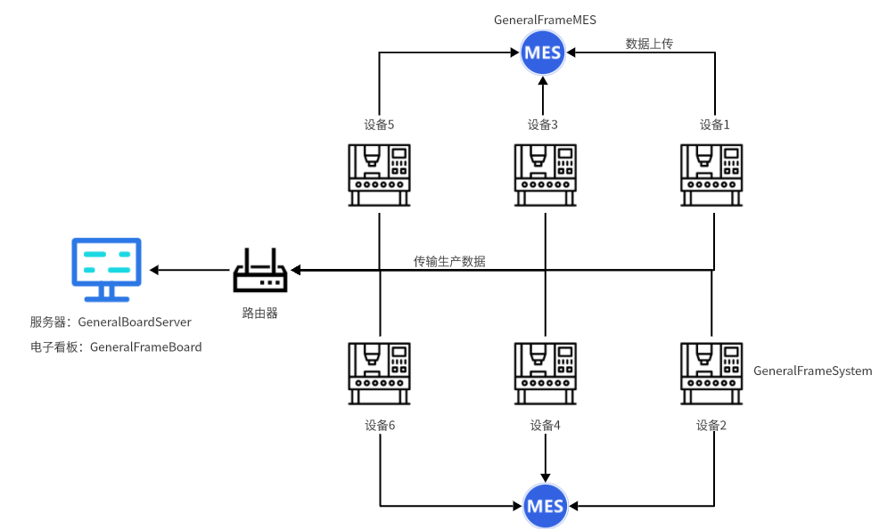

# General-solutions-of-data-acquisition

> 一套完整的工业自动化监控、数据采集与 MES 集成解决方案

---

## 📌 项目概述

本项目是一个分层式的工业软件架构，涵盖了从现场端数据采集（SCADA）、生产数据看板（Dashboard）到生产执行系统接口（MES API）的全流程实现。

## 📄 技术方案（PPT）
👉 [点击查看完整方案](./上位机技术解决方案.pptx)
---

## 🏗 系统架构

项目由以下四个核心子系统组成：

### 1️⃣ SCADA 控制系统 (GeneralFrameSystem)

**开发环境：** WinForms (.NET) + MySQL  

**核心功能：**
- 权限管理：灵活的用户权限分配与本地/在线登录模式  
- 实时监控：模块化运行界面  
- 数据通讯：PLC 参数配置与点位映射  
- 生产追溯：MES 交互记录  
- 配方系统：多型号生产切换  

---

### 2️⃣ 电子看板服务器 (GeneralFrameBoard)

**开发环境：** WinForms + MySQL  

**主要功能：**
- 数据网关  
- 数据清洗与存储  
- 提供稳定数据源  

---

### 3️⃣ 数据可视化大屏 (GeneralBoardServer)

**技术选型：**
- C/S：WPF  （√）
- B/S：ASP.NET Core + jQuery  

**主要功能：**
- 实时生产指标可视化  
- 效率统计  
- 产线状态监控  

---

### 4️⃣ MES 集成接口 (GeneralFrameMES)

**技术选型：** ASP.NET Core WebAPI + MySQL  

**核心 API：**
- Auth：用户认证  
- Validate：条码校验  
- Upload：数据上传  
